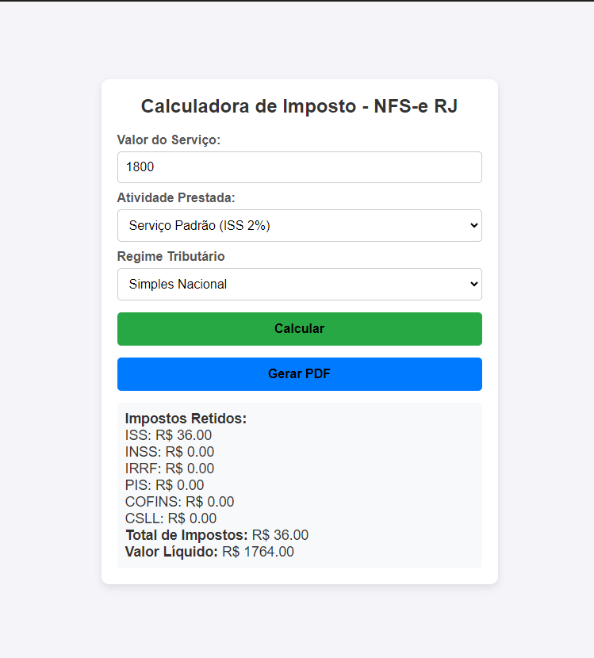
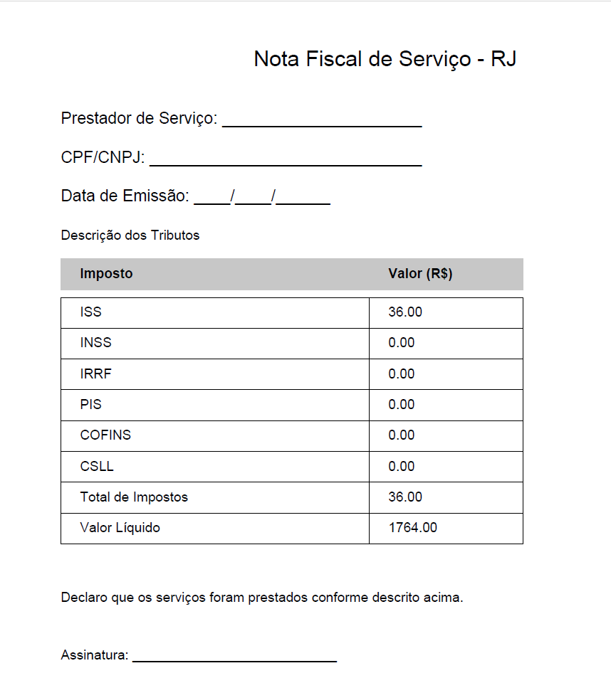

# Calculadora de Imposto - NFS-e RJ (Estudos)

## Descrição:

Este projeto é uma calculadora de imposto para serviços prestados no município do Rio de Janeiro, 
permitindo calcular ISS, INSS, IRRF, PIS, COFINS e CSLL com base no regime tributário. 
Além disso, permite gerar um PDF com os dados formatados no estilo de uma Nota Fiscal de Serviço Eletrônica (NFS-e).

## Funcionalidades
 - Cálculo automático de impostos com base no regime tributário e atividade prestada
 - Interface intuitiva e responsiva, com formulário estilizado próximo ao modelo da NFS-e
 - Geração de PDF estruturado, com cabeçalho, tabela de impostos e rodapé com assinatura
 - Opção de escolha entre diferentes regimes tributários (Simples Nacional, Lucro Presumido, Autônomo)
 - Uso de JavaScript puro e jsPDF para criação dinâmica do PDF

## Tecnologias Utilizadas
 - Tecnologias Utilizadas
 - HTML + CSS (para estilização do formulário no formato de uma nota fiscal)
 - JavaScript (para cálculo dos impostos e geração do PDF)
 - jsPDF (para criar o documento PDF estruturado)

## 📸 Demonstração
🔹 Interface do Formulário

🔹 Exemplo de Nota Fiscal em PDF

## Como usar?

- 1 Clone o repositório
  git clone https://github.com/douglasinforj/calculadora_imposto_nota_fiscal.git
- 2 Abra o arquivo index.html no navegador
- 3 Digite o valor do serviço e escolha o regime tributário
- 4 Clique em "Calcular" para visualizar os impostos
- 5 Clique em "Gerar PDF" para baixar a Nota Fiscal formatada

## Melhorias Futuras

Melhorias Futuras
- Integração com APIs de consulta de alíquotas
- Adição de gráficos com estatísticas dos impostos calculados
- Versão responsiva para dispositivos móveis
- Integração com WebServices da prefeitura para emissão oficial de NFS-e

## Tabelas usadas como base de Calculos:
| Base de Cálculo (R$)      | Alíquota (%) | Parcela a Deduzir (R$)  |
|---------------------------|--------------|-------------------------|
| Até 1.903,98              | 0%           | 0,00                    |
| 1.903,99 até 2.826,65     | 7,5%         | 142,80                  |
| 2.826,66 até 3.751,05     | 15%          | 354,80                  |
| 3.751,06 até 4.664,68     | 22,5%        | 636,13                  |
| Acima de 4.664,68         | 27,5%        | 869,36                  |

## Licença
Este projeto é de código aberto sob a licença MIT.

Desenvolvido por Douglas Silva